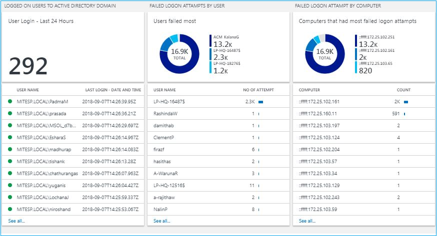
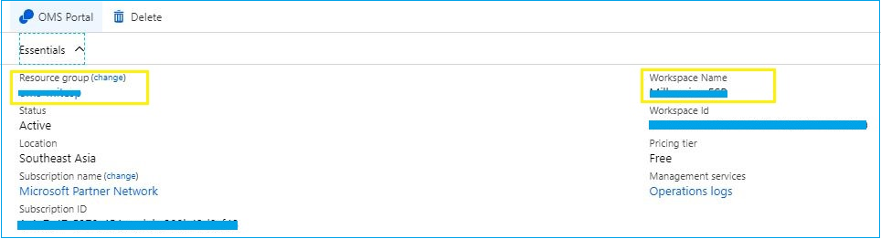

# Active Directory Security Audit Solution

 

AD Security Audit Solution collects security events from domain controllers and filter them with Azure log analytics queries to visualize in OMS Dashboards. It have two attractive dashboard to display following information. 

*	Created and deleted domain users with time and by whom
*	Created and deleted domain groups with time and by whom
*	Group membership changes with the group, added or removed user and time. (ex – Domain admin or Enterprise admin group membership changes)
*	Number of Users logged in to the domain by last 24 hours
*	Domain users logged in to the domain with time and user name
*	Failure logon attempts by user
*	Failure logon attempts by computer
*	Locked user accounts with the source where account locked
*	Domain user logged on Computer by its IP address and the updated time and date.

Users And Groups Monitoring

User Account Security Monitoring

## Prerequisites 

* #### OMS Log Analytics Workspace
Log analytics workplace is required to host this solution. You can either select the free version or the paid version. Free version supports 500mb of daily upload and 7 days of retention. 
* #### Azure Security Center license 
Azure Security Center licensing is required to collect Security event and search from Domain controllers. This is also known as OMS Security and Compliance license. Azure Security Center is offered in two tiers: Free and Standard. The Standard tier is free for the first 60 days. You can either use the free tier or use the standard node license to all domain controllers. 
* #### OMS Agent installed in Domain controllers. 
OMS agent should be installed in every domain controller.
* #### OMS workplace name and Resource group name
To deploy the solution you should know the OMS workspace name and the its related resource group name, for the current version you have to deploy it to the same resource group with the workspace

## Deploying the Active Directory Security Audit Solution
###Follow these instructions to deploy the solution into an existing OMS workspace
Log into Azure Portal (https://portal.azure.com) and ensure you are in the subscription containing your OMS Workspace
Locate your existing OMS Log Analytics Workspace and note the name of the workspace, the location of the workspace, and the Resource Group

